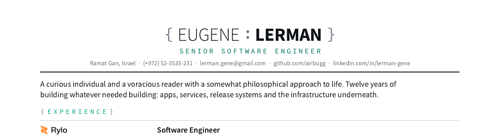

# Eugene Lerman - Curriculum Vitae

<p align="center">
  <a href="https://github.com/airbugg/curriculum-vitae/releases/latest/download/eugene-lerman.pdf">
    
  </a>
</p>

## Download

| Variant | For | |
| --- | --- | --- |
| Default | humans, referrals | [PDF](https://github.com/airbugg/curriculum-vitae/releases/latest/download/eugene-lerman.pdf) |
| Shell | the CV as a terminal session | [PDF](https://github.com/airbugg/curriculum-vitae/releases/latest/download/eugene-lerman-shell.pdf) |
| Full-stack | backend and AI screening | [PDF](https://github.com/airbugg/curriculum-vitae/releases/latest/download/eugene-lerman-fullstack.pdf) |

Every push to `master` with a [Conventional Commit](https://www.conventionalcommits.org) subject cuts a [release](https://github.com/airbugg/curriculum-vitae/releases/latest). PDFs are built, not committed. Two further builds (`-public`, `-staff`) ship in CI artifacts but are not attached to releases yet; `.releaserc.json` is the list of what a release attaches.

## Edit

Each fact lives in exactly one file. Click to edit in the browser, then **replace GitHub's default commit message** with one like `docs(cv): update the Rewire bullets`. That prefix is what cuts the release; without it the PDFs rebuild but do not publish, and CI fails saying so.

| File | Holds |
| --- | --- |
| [`person.md`](https://github.com/airbugg/curriculum-vitae/edit/master/content/person.md) | name, contact, languages |
| [`intro.md`](https://github.com/airbugg/curriculum-vitae/edit/master/content/intro.md) | opening paragraph, per variant |
| [`jobs/1-rylo.md`](https://github.com/airbugg/curriculum-vitae/edit/master/content/jobs/1-rylo.md) | Rylo |
| [`jobs/2-remitly-staff.md`](https://github.com/airbugg/curriculum-vitae/edit/master/content/jobs/2-remitly-staff.md) | Remitly |
| [`jobs/3-rewire.md`](https://github.com/airbugg/curriculum-vitae/edit/master/content/jobs/3-rewire.md) | Rewire |
| [`jobs/4-wix.md`](https://github.com/airbugg/curriculum-vitae/edit/master/content/jobs/4-wix.md) | Wix |
| [`jobs/5-lab.md`](https://github.com/airbugg/curriculum-vitae/edit/master/content/jobs/5-lab.md) | the lab job, kept but unused |
| [`education.md`](https://github.com/airbugg/curriculum-vitae/edit/master/content/education.md) | degree, school, dates |
| [`publications.md`](https://github.com/airbugg/curriculum-vitae/edit/master/content/publications.md) | the paper |
| [`skills.md`](https://github.com/airbugg/curriculum-vitae/edit/master/content/skills.md) | the STACK chips |

Job frontmatter wants `id`, `company`, `role`, `location`, `dates` (`Mon YYYY – Mon YYYY`, or `Present`, with an en dash; a plain hyphen fails the build). Bullets end in a `{#id}` anchor and backticks become tech chips. Any broken reference, duplicate key or malformed line fails the build naming the file.

## Build

```sh
npm install
npm run build   # dist/*.pdf
npm run check   # types + formatting
npm run format  # apply formatting
```

Node 22.18+ and Chromium (`CHROME_PATH` if it is somewhere unusual). A variant that runs past one A4 page fails the build.

## Layout

| | |
| --- | --- |
| `content/` | every fact, once |
| `src/variants.ts` | what each variant picks |
| `src/components/` | `grid/` and `terminal/` layouts, `shared/` primitives |
| `src/themes/` | one CSS file per theme |
| `src/lib/` | content loaders, dates, fonts, brand marks |
| `src/validate.ts` | every cross-file reference a variant makes |
| `build.ts` | bundle, render, print, check one page |
| `scripts/preview.ts` | the banner above |
| `DESIGN.md` | why it looks the way it does |
| `CLAUDE.md` | what will bite you |

Commits follow [Conventional Commits](https://www.conventionalcommits.org), checked by commitlint in a commit hook and again on every PR. Direct pushes to `master` skip both checks, so the release job fails loudly if a push cut no version. semantic-release turns the commits into the version, the tag and the release notes.
